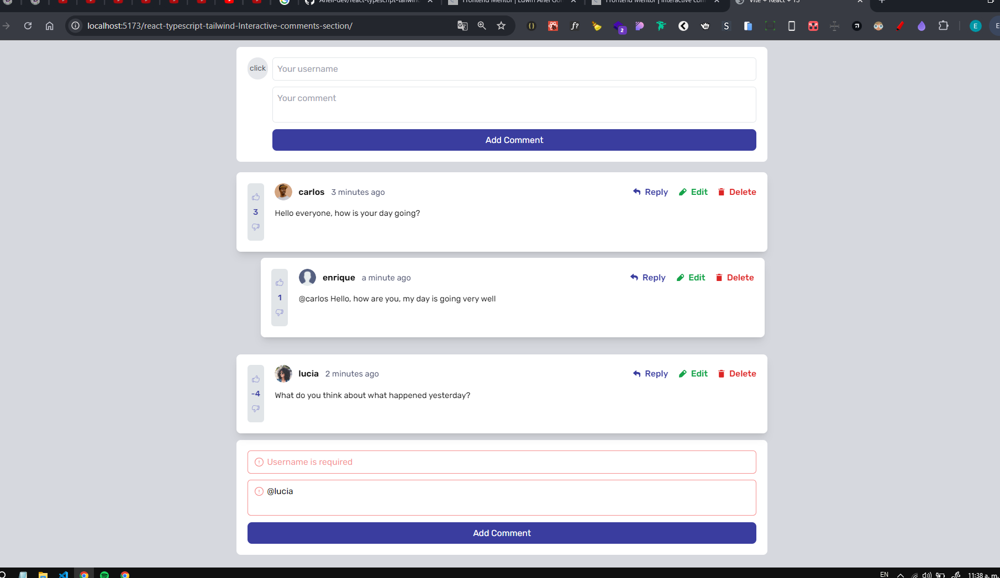

# Interactive comment section

## Welcome!👋

Here you can see the final result -> [https://Anell-dev.github.io/react-typescript-tailwind-Interactive-comments-section/](https://Anell-dev.github.io/react-typescript-tailwind-Interactive-comments-section/)

### The challenge

Users should be able to:

- View the optimal layout of the application based on the screen size of their device.
- View the hover states of all interactive elements on the page.
- View your previous comments without losing them.
- Generate a new comment
- Edit the comment
- Leave a reply
- Delete the comment
- Like or dislike

## Autor

- Profile on LinKedin - [Edwin Anel González](https://www.linkedin.com/in/edwin-anel-gonz%C3%A1lez-978b6a234/)

- Profile on Instagram - [@anell.dev](https://www.instagram.com/anell.dev/)
- Profile on GitHub - [@Anell-dev](https://github.com/Anell-dev)
- Profile on FrontendMentor - [@Anell-dev](https://www.frontendmentor.io/profile/Anell-dev)

### Built with

- TypeScript
- React
- Hooks
- JavaScript
- Vite
- Prettier
- Eslint
- Tailwind
- Flexbox

### Links

- Solution URL: [https://github.com/Anell-dev/react-typescript-tailwind-Interactive-comments-section](https://github.com/Anell-dev/react-typescript-tailwind-Interactive-comments-section)
- Live Site URL: [https://Anell-dev.github.io/react-typescript-tailwind-Interactive-comments-section/](https://Anell-dev.github.io/react-typescript-tailwind-Interactive-comments-section/)

### Preview

